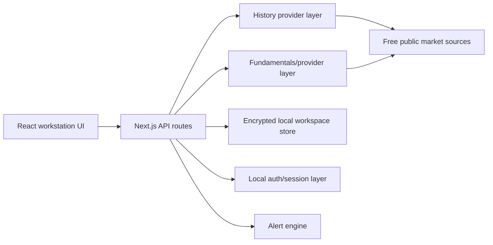

# Architecture

Stock Analyser is a Next.js App Router application with server-side API routes for data retrieval, workspace persistence, and security-sensitive actions.

## High-Level Flow

## Main Areas

| Area | Path | Responsibility |
| --- | --- | --- |
| App shell and routes | `app/` | Pages, API routes, proxy/middleware security |
| UI | `src/components/StockAnalyser.tsx` | Workstation, landing page, workspaces, tabs |
| Analysis | `src/lib/analysis.ts` | Orchestrates history, fundamentals, peers, recommendation |
| History | `src/lib/history.ts`, `src/lib/stooq.ts` | Stooq-first and free-source historical price retrieval |
| Fundamentals | `src/lib/fundamentals.ts` | Public-source fundamentals and source records |
| Indicators | `src/lib/indicators.ts` | MA, RSI, ROC, 52-week metrics |
| Recommendation | `src/lib/recommendation.ts` | Transparent value, momentum, and data quality scoring |
| Workspace | `src/lib/workspace-store.ts` | Encrypted local watchlist, portfolio, alerts, privacy, audit data |
| Cloud workspace foundation | `src/lib/cloud-workspace.ts`, `database/migrations/` | Cloud readiness, schema versioning, and database migration target |
| Auth | `src/lib/auth.ts` | Local encrypted auth and signed session cookies |
| Security | `src/lib/security.ts`, `proxy.ts` | Headers, CSRF-style mutation checks, rate limits |
| Alerts | `src/lib/alert-engine.ts` | Rule evaluation, notifications, scheduler runs |

## Data Integrity Principles

- No paid APIs by default.
- No fabricated data.
- `Data unavailable` is preferred over guessed metrics.
- Every source-derived metric should preserve source URL, retrieval time, freshness, and warnings where available.
- Recommendation scoring must remain transparent and explainable.

## Workspace Model

The current implementation is local-first:

- Anonymous workspace: `anonymous:local-default`
- Authenticated local workspace: `user:<local-user-id>`
- Storage: `.stock-analyser-data/`
- Encryption: AES-256-GCM envelope with local key file or environment secret

This shape is intentionally provider-ready. A cloud adapter should preserve the same domain contracts while replacing local encrypted files with tenant-isolated storage.

The current cloud database target is PostgreSQL schema v1 in `database/migrations/0001_cloud_workspace.sql`, documented in `docs/CLOUD_DATABASE_ADAPTER.md`.

## Alert Model

Alert rules support:

- Metrics: latest close, RSI 14D, percent from 52-week low, 5D performance
- Operators: above, below
- Schedules: manual, hourly, daily

Execution modes:

- Page-active scheduler: runs while the web page is open.
- Hosted worker endpoint: `/api/alerts/worker`, protected by a bearer secret and ready for cron/job integration.

## Current Production Gap

The app is feature-rich locally, but production multi-user use requires hosted auth, hosted storage, managed secrets, backups, and always-on scheduling.
